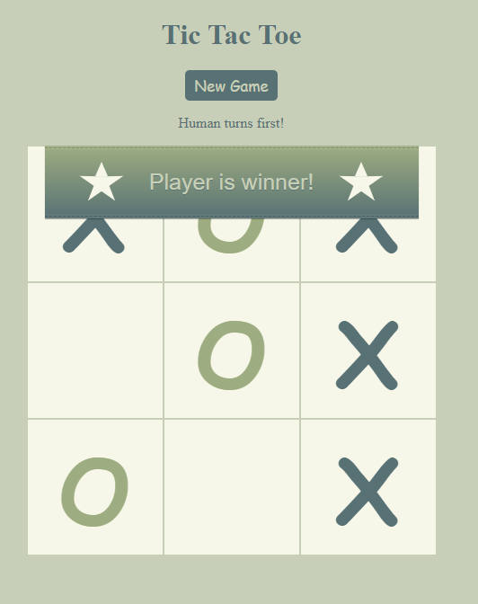

# Tic Tac Toe React Typescript App

- React
- Redux
- React/Reducx Toolkit
- useState
- useEffect
- useSelector
- models OOP

## Install and Run

`npm install`   - installing all modules
`npm start`     - start App
default URL `http://localhost:3000/`

## Test App

`npm test`      - run included tests

## Screenshot

